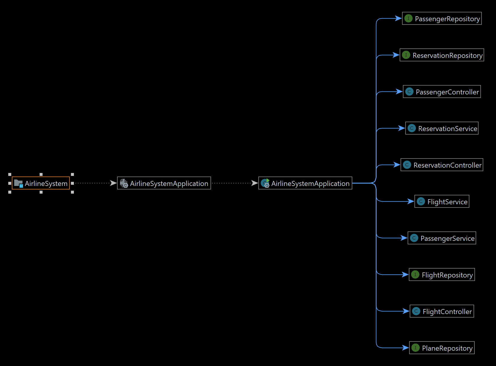

## This project is made under the internship program arranged by CodeClause
# Airline-Reservation-System
# Author: Dinesh Haribhau Dixit

Flowchart:
  

Endpoints:
  

Overview:
 
Working Methods:                                                               
1.Create passenger                                                                                         
2.Get Passenger                                                                                                
3.Update Passenger                                                                                            
4.Delete Passenger                                                                                            
5.create Reservation                                                                                                
6.Get Reservation                                                                                                   
7.Update Reservation                                                                                             
8.delete Reservation                                                                                               
9.create flight                                                                                                  
10.update flight                                                                                                     
11.delete flight                                                   
##### All endpoints are working and have checked with postman client.If you find any bug please contact me.

### references used for project
https://www.geeksforgeeks.org/online-railway-ticket-reservation-system/
https://projectworlds.in/java-projects-with-source-code/airline-reservation-system-java-project/

1.Baeldung => https://www.baeldung.com/spring-b                                                            
2.JavatPoint => https://www.javatpoint.com/spring-boot-tutorial                                        
3.https://www.javatpoint.com/spring-boot-rest-example                                              
4.https://spring.io/guides/tutorials/rest/                                                             
5.https://www.baeldung.com/rest-with-spring-series                                                        
6.https://howtodoinjava.com/spring-boot2/rest/rest-api-example/                                               
7.Github Repositories                                                                                            

### For  Error Solving:
1.StackOverflow                                                             
2.ChatGPT

### Tools used:
IDE:IntelliJ Idea                                                                 
Technologies: Springboot-2.7.11 ,  Java-8, Data-Jpa, MySql, Lombok                                                              
Client: Postman                                                   

This project is made with the help of github repositories and various websites and have made appropriate changes
for make it working.

### contact
Portfolio: http://mechatron.epizy.com

Linkedin: https://www.linkedin.com/in/dinesh-dixit

Github: https://github.com/Mechatron00
